# Parallel Word Counting with MPI

## 1. Team Information
* **José David Martínez Fernández**
* **Gabriel Omar Páez Rolong**
* **Jhosep Ricardo Varela Regalado**
* **Alejandro Vargas Visbal**

## 2. Problem Description

The objetive for this laboratory is to design, implement and evaluate experimentally, parallel implementations for a text processing problem. More specifically, the goal is to count how many times does a set of keywords appear (defined on `consulta.txt`) within a large body of text that is divided into multiple files (`file_XXXX.txt`). Finally, the implementation reports the 10 most frequent words.

The problem would first be addresed with a sequential implementation, followed by two parallel implemntations using MPI (Message Passing Interface): the first with a static file distribution and the second with a dynamic load balancing, to analyse how the number of processes and strategy of distribution of loads affect the general performance (Speedup, Efficiency, Balancing).

## 3. Environment and Execution Instructions
To ensure a reproductible and consistent environment, all implementations are performed inside a Docker container provided for the lab.

### Prerequisites
* Docker installed and running.
* Dataset generation:
Before running the tests, the dataset must be generated using: 
  ```
  docker run --rm -v "$(pwd):/app" augustosalazar/slim-mpi:2 python /app/generator.py
  ```
  or
  ```
  docker run --rm -v "%cd%:/app" augustosalazar/slim-mpi:2 python /app/generator.py 
  ```

### Execution
* Sequential baseline execution:
  ```
  docker run --rm -v "$(pwd):/app" augustosalazar/slim-mpi:2 python /app/baseline_secuencial.py
  ```
  or
  ```
  docker run --rm -v "$(pwd):/app" augustosalazar/slim-mpi:2 python /app/baseline_secuencial.py
  ```
* MPI version 1 (example with 4 workers*):
  ```
  docker run --rm -v "%cd%:/app" augustosalazar/slim-mpi:2 mpirun --oversubscribe -n 4 --allow-run-as-root python /app/mpi1.py
  ```
* MPI version 2 (example with 4 workers*):
  ```
  docker run --rm -v "$(pwd):/app" augustosalazar/slim-mpi:2 mpirun --oversubscribe -n 4 --allow-run-as-root python /app/mpi2.py
  ```
  or
  ```
  docker run --rm -v "%cd%:/app" augustosalazar/slim-mpi:2 mpirun --oversubscribe -n 4 --allow-run-as-root python /app/mpi2.py
  ```

> (*NOTE: To modify the number of processes, change the value after the `-n` flag on the mpirun's commands.)

## 4. Experimental plan

### a. Sequential baseline
The `baseline_secuencial.py` script fetches the keywords to look for from `consulta.txt` y and stores them insde a set on memory. Then, iterates linearly for every `file_*.txt` present in the corpus' directory. For each line in every file, the words are extracted, converts them to lowercase and verifies if they are in the objective word set. If they are, a global counter increases (Counter on Python). Once all the files have been read, the results are sorted, the 10 most frequent words are printed, and the total count is saved in a CSV file.

### b. MPI version 1
The `mpi1.py` script implements a static load-balancing model.
1. The master process (Rank 0) reads the query words and determines the complete list of files in the corpus.
2. This list is divided into equal parts (chunk) dependant on the communicator size (number of processes)
3. Rank 0 uses `comm.bcast` to transmit the query words to every process and `comm.scatter` to assign each node its respective file **chunk**.
4. Each process (including the master) iterates over its file chunk independently, processing matches and keeping a local count.
5. Finally, `comm.gather`is used to collect each local counter, processing time and tokens at Rank 0, which consolidates the countersa and extracts the 10 most frequent words globally.

### c. Test procedure
To evaluate the performance of both MPI implementations the following procedure will be done:
1. The number of available physical/logical cores in the container will be verified.
2. Tests will be run for p configurations of `{1, 2, 4, 8}` processes.
3. To account for variations in the operating system, four runs will be performed for each configuration.
4. The total execution time and local time for each process will be recorded to calculate the **Speedup**, **Efficiency** and to identify the load imbalance.

---

## 5. Experimental plan execution
### a. Sequential baseline timings

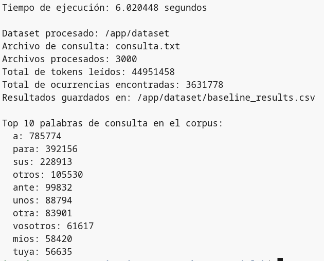

* **1st run:** `6.0204` seconds
* **2nd run:** `5.9594` seconds
* **3rd run:** `5.9587` seconds
* **4th run:** `6.0089` seconds
* **Sequential Average (Tseq):** `5.9868` seconds

### b. MPI version 1 timing results
#### MPI 1 - 1 Worker
<table>
  <tr>
    <td>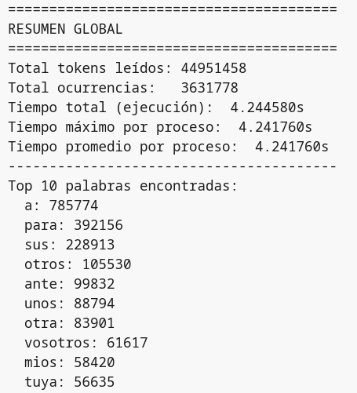</td>
    <td>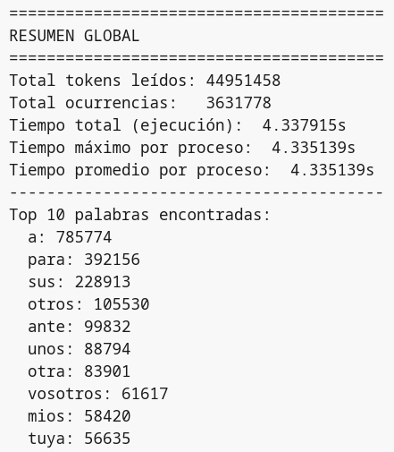</td>
  </tr>
  <tr>
    <td>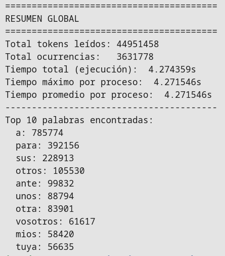</td>
    <td>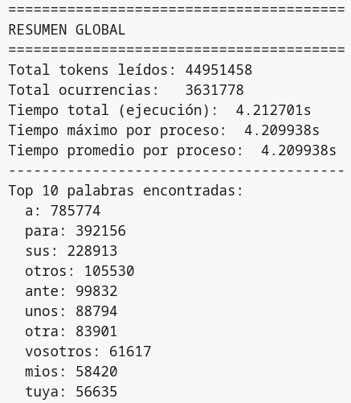</td>
  </tr>
</table>

#### MPI 1 - 2 Workers
<table>
  <tr>
    <td>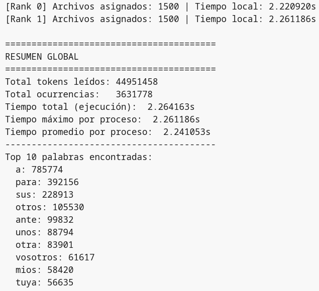</td>
    <td>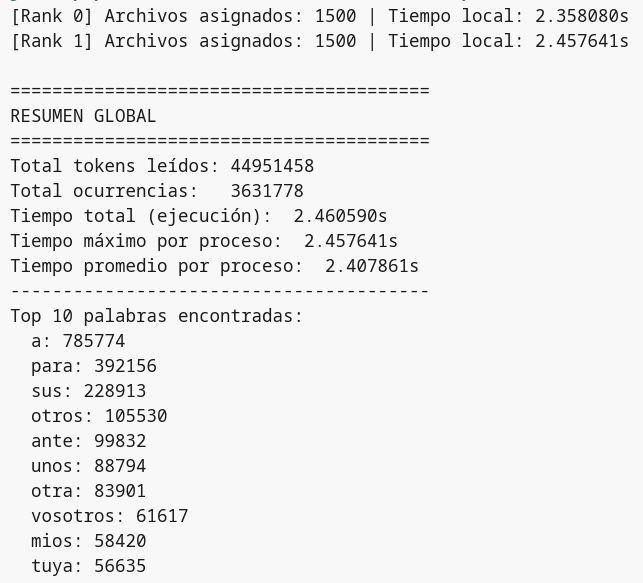</td>
  </tr>
  <tr>
    <td>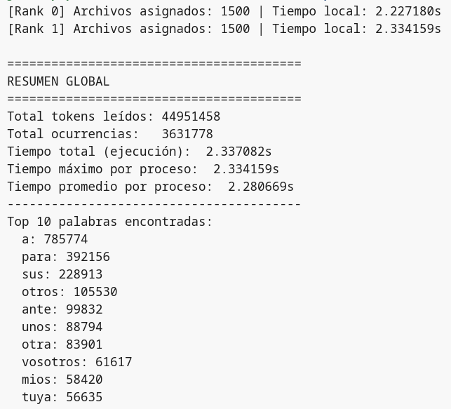</td>
    <td>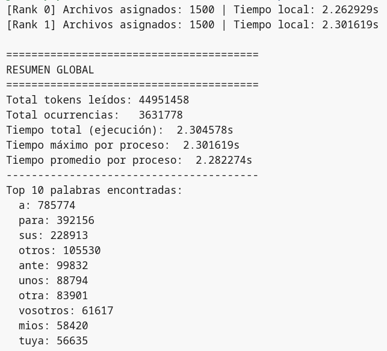</td>
  </tr>
</table>

#### MPI 1 - 4 Workers
<table>
  <tr>
    <td>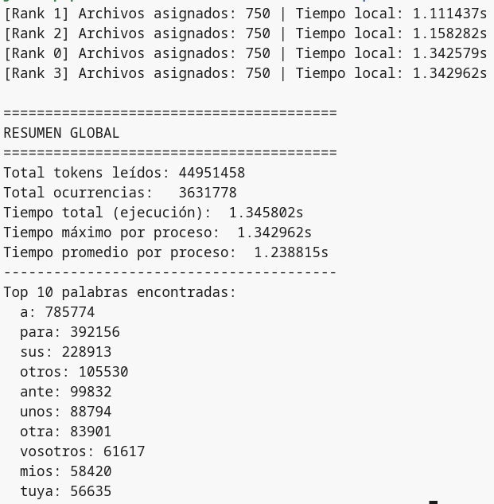</td>
    <td>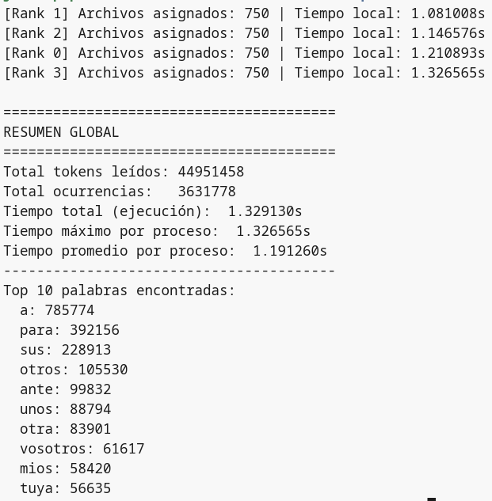</td>
  </tr>
  <tr>
    <td></td>
    <td>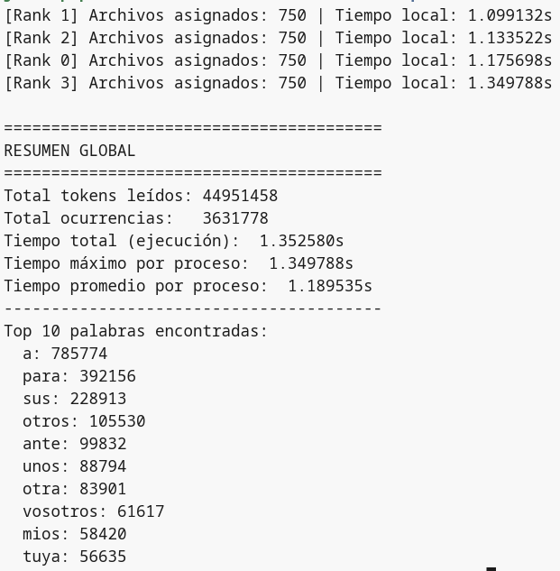</td>
  </tr>
</table>

#### MPI 1 - 8 Workers
<table>
  <tr>
    <td></td>
    <td>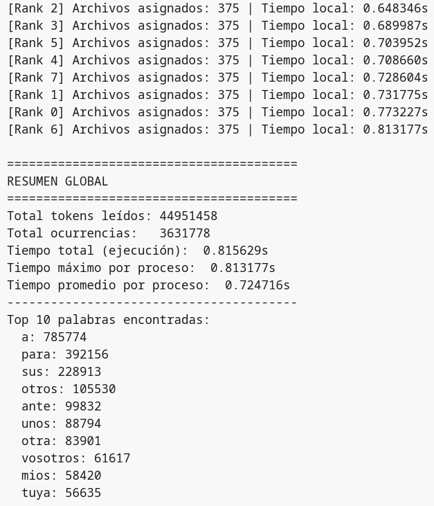</td>
  </tr>
  <tr>
    <td></td>
    <td>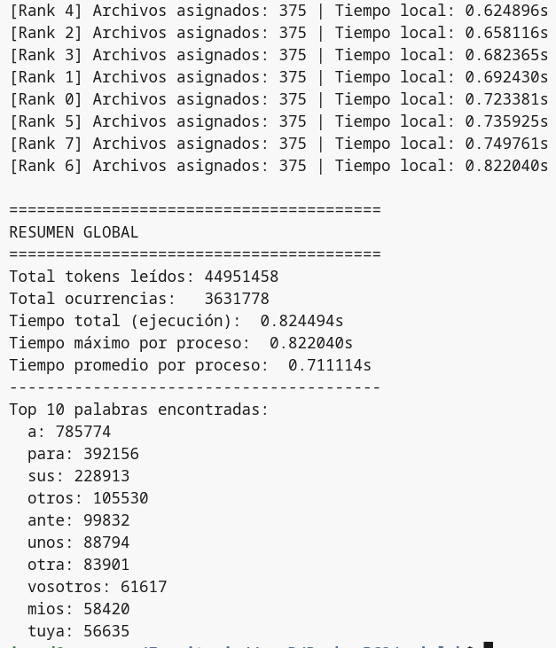</td>
  </tr>
</table>

##### MPI 1 Results Summary
| Workers | Average time (seconds) | Balance ratio | Efficiency | Speedup |
| --- | --- | --- | --- | --- |
| 1 | 4.26735 | 1 | 1.4 | 1.4 |
| 2 | 2.34152 | 1.0143 | 1.275 | 2.55 |
| 4 | 1.337225 | 1.1139 | 1.119 | 4.477 |
| 8 | 0.83215 | 1.1459 | 0.899 | 7.1943 |


### c. Load imbalance evidence
In all runs involving more than two processes, we are able to identify that some processes have a longer-than-average execution time; this becomes more apparent as the number of processes increases and leads to significant imbalance, resulting in wasted available resources.

### d. Implementation of MPI Version 2 correcting the imbalance with its timing results
The MPI version 2, `mpi2.py` implements the Dynamic Master-Worker Pattern, by dividing the execution into two sequential phases to optimize the work.

On the first phase, Rank 0 acts as an dedicated administrator that does not process text, unless `size == 2`; instead, it waits on a blocked loop listening to request with `comm`. And `recv` to any message with `tag=TAG_REQUEST`, assigning files sequentially with a pointer (`siguiente`) with a `TAG_WORK` message, or sending a **Turn Off signal**: `TAG_FIN` when the queue ends, `workers_activos -= 1`. For the Workers (`rank > 0`), they request files, process them independently, accumulating the results in their `local_counter`, and only when they break their working loop, they emit an unique message with `tag=TAG_RESULT`.

On the second phase, the Master executes a recollecting loope (`for _ in range(1, size)`) designed to recieve these final dictionaries, join the global frequencies with `freq_global.update()` and calculate the umbalancing metrics, removing completely the constant overload in the process and avoiding racing conditions.

#### MPI 2 - 1 Worker (Proceso)
<table>
  <tr>
    <td>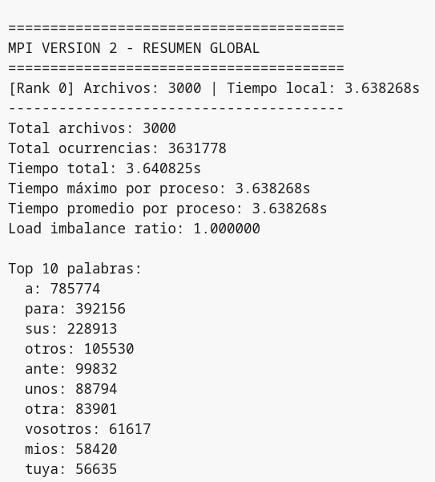</td>
    <td>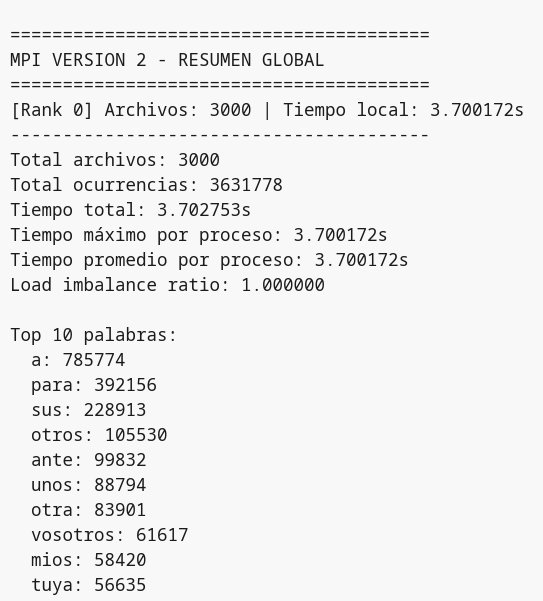</td>
  </tr>
  <tr>
    <td></td>
    <td>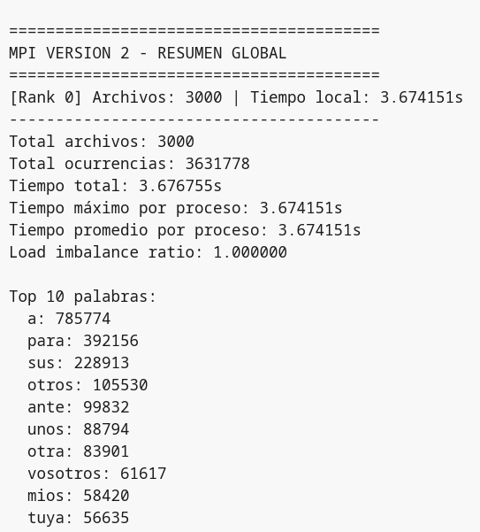</td>
  </tr>
</table>

#### MPI 2 - 2 Workers
<table>
  <tr>
    <td>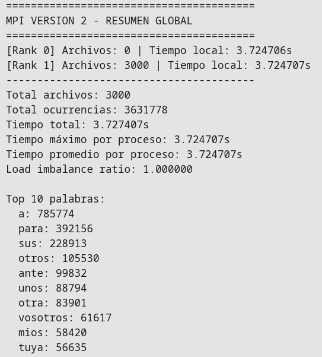</td>
    <td></td>
  </tr>
  <tr>
    <td>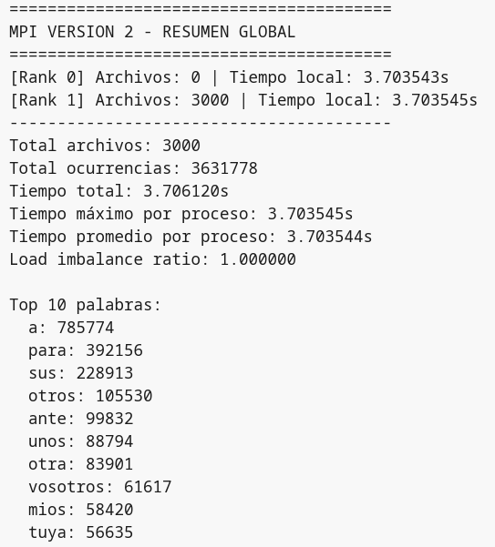</td>
    <td>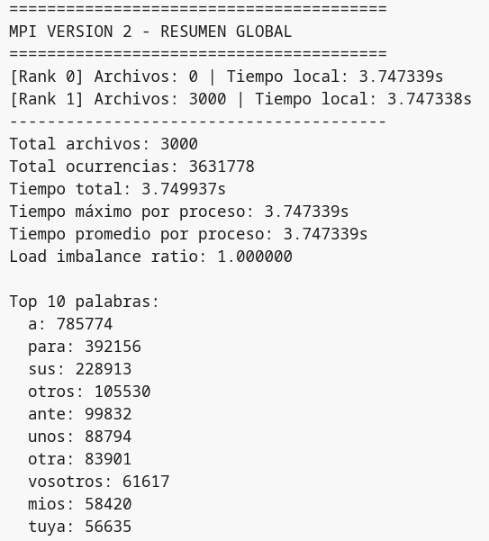</td>
  </tr>
</table>

#### MPI 2 - 4 Workers
<table>
  <tr>
    <td>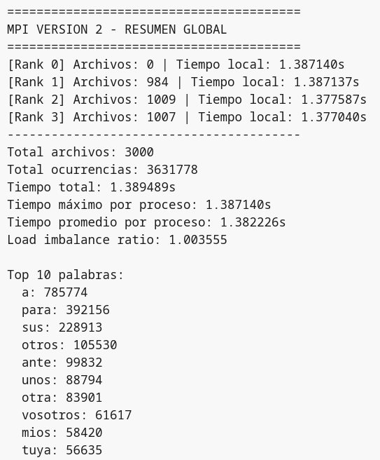</td>
    <td></td>
  </tr>
  <tr>
    <td>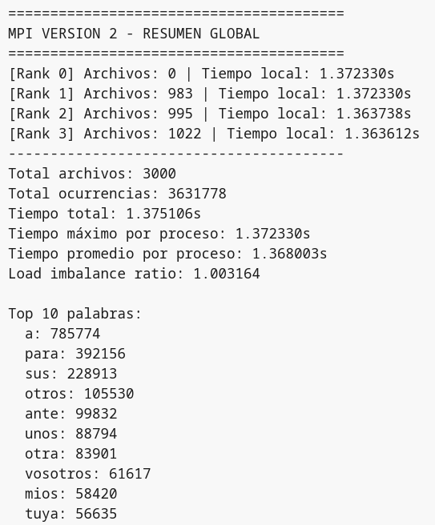</td>
    <td>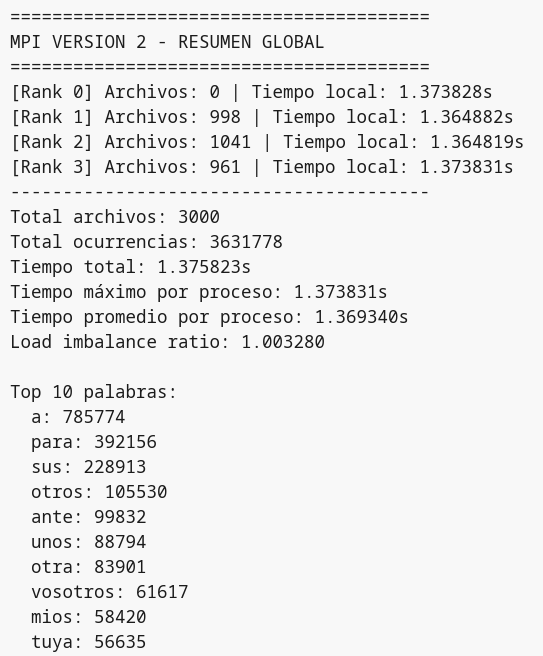</td>
  </tr>
</table>

#### MPI 2 - 8 Workers
<table>
  <tr>
    <td></td>
    <td>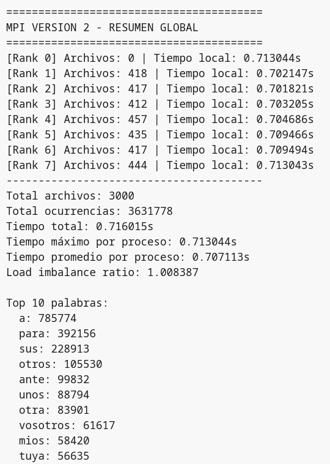</td>
  </tr>
  <tr>
    <td>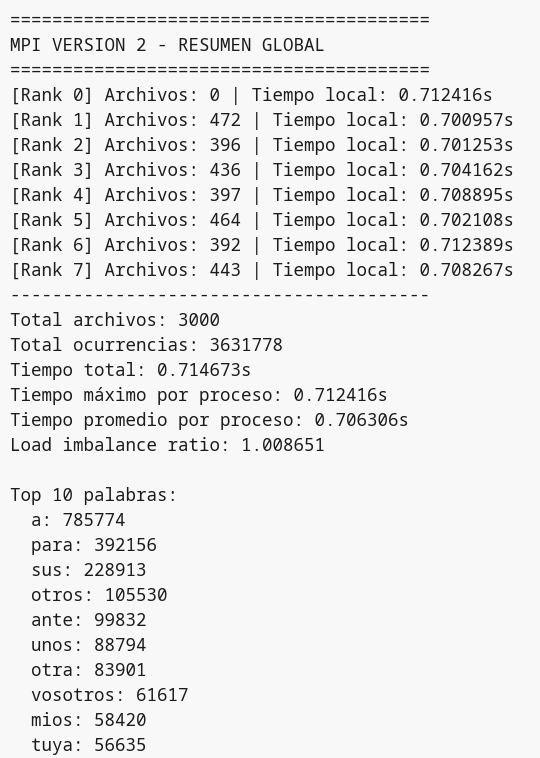</td>
    <td></td>
  </tr>
</table>

##### MPI 2 Results Summary
| Workers | Average time (seconds) | Speedup | Efficiency |
| --- | --- | --- | --- |
| 1 | 3.6678 | 1.63 | 1.63 |
| 2 | 3.7103 | 1.61 | 0.805 |
| 4 | 1.3828 | 4.32 | 1.085 |
| 8 | 0.7163 | 8.35 | 1.043 |

## 6. Analysis

**a. Did the first MPI implementation improve execution time compared to the sequential baseline?**
* The `mpi1.py` parallel implementation **significantly improved** the execution time of the sequential version

**b. Was the observed speedup linear?**
* **The speedup is not linear**; as the number of processes increases, the speedup does not increase at exactly the same rate, and its rate of increase slows as the number of processes increases. 

**c. Is there evidence of load imbalance? How was it observed?**
* **Yes, there is an imbalance**, which can be observed by comparing the maximum execution time of a process with the average execution time of all processes.

**d. Did the second implementation reduce load imbalance?**
* **The second implementation almost completely eliminated the imbalance**, yielding results very close to 1.

**e. Did the improved distribution strategy produce a real performance improvement?**
* **Yes, but its effectiveness depends on the number of processes**. With 4 processes, MPI 1 is slightly faster because it uses the master as an additional active worker (*4 compute threads versus only 3 in MPI 2*) and does not suffer from message overhead on the network. **However**, when scaling to 8 processes, MPI 2 performs better with dynamic load balancing, keeping all 7 workers at 100% capacity and eliminating the downtime caused by load imbalance that slows down MPI.

**f. What limitations affected your experiment?**

* ```
  docker run --rm augustosalazar/slim-mpi:2 nproc
  ```
  > 16

  Running multiple processes creates a physical bottleneck that limits ideal linear scalability; even if there are enough execution threads, the processes may be competing for execution time and for file loading from main memory.

## 7. Conclusions
**Both parallel implementations successfully reduced execution time relative to the sequential baseline of `~5.99` seconds**, with MPI 1 reaching **~0.83 seconds** and MPI 2 reaching **~0.72 seconds** at 8 workers, speedups of `~7.19` and `~8.35` respectively: confirming that parallelizing this I/O-bound, text-search workload is an effective strategy that scales with process count.

However, MPI 1's static file distribution reveals a fundamental limitation: assigning fixed blocks before execution ignores variability in file size and word density, causing some processes to finish early and sit idle while waiting for the slowest one. This is reflected in a balance ratio that grows from `1` to `~1.15` as workers increase, and an efficiency that falls from `1.4` down to `~0.90` at 8 workers, meaning the system wastes nearly **10%** of its computational capacity, a penalty that would worsen on more heterogeneous datasets.

MPI 2's **Dynamic Master-Worker** pattern directly addresses this by assigning files one at a time on demand, and its two-phase communication design, where workers send a single consolidated result at the end rather than reporting back on every file: further reduces network overhead and eliminates race conditions. At 8 workers the results speak clearly: efficiency of `~1.04` and a speedup that nearly matches the ideal line. The one notable exception is at 2 workers, where MPI 2's efficiency drops to `~0.81`, **below MPI 1's `~1.28` at the same point**, exposing that a dedicated master who processes no files carries a fixed coordination cost that only becomes worthwhile when enough workers are present to absorb it.

From 4 workers onward, **MPI 2** recovers and consistently outperforms its static counterpart, **making it the stronger implementation overall**, provided the deployment environment can supply sufficient parallelism to justify the overhead.